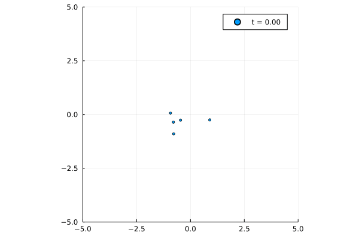

# N-Body Simulation

Basic N-body simulation created in Julia. Mainly learning how Juila modules work too.



## Usage
Navigate to the working directory, activate, then (if needed) instantiate the project environment:
```
julia> ]
pkg> activate .
pkg> instantiate
```
To run the script non-interactively:
```
$ julia --project=. simulation.jl
```
Interactively:
```
julia> include("simulation.jl")
```